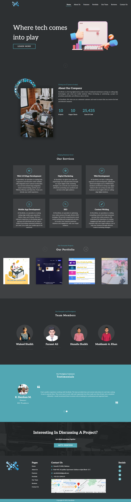

# Xerofinity.

#### Where Tech Comes Into Play!! - Xerofinity is a basic website developed for a startup initiative with friends. Though the startup is no longer operational, the project stands as a testament to collaborative efforts and web development skills.

---

### ⚒ Project Demo:

Experience the project in action by visiting our live demo: [Xerofinity Live](https://xerofinity.vercel.app/)

---

### 📜 Case Study for "Xerofinity":

#### 🔗 Website URL: https://xerofinity.vercel.app/
#### 😋 GitHub URL: https://github.com/faraasat/xerofinity

#### 📚 Role: Software Developer

#### 💎 Client: Personal Project

#### 📌 Problem:
The goal was to establish an online presence for the startup, providing essential information about its services and vision. A simple, yet effective website was required to present this information in a clear and engaging manner.

#### ⚡ Solution:
The solution was to create Xerofinity, a straightforward website using JavaScript, HTML, and CSS. The site featured intuitive navigation and a clean design, ensuring visitors could easily find and understand the startup’s offerings.

#### 🚀 Result:
The resulting website successfully provided a digital platform for the startup, allowing it to share information and connect with potential clients. Although the startup has since ceased operations, the website remains a functional example of efficient web design and development.

### 🤹‍♂️ Skills Utilized:

&nbsp;&nbsp;&nbsp;&nbsp;
&nbsp;&nbsp;&nbsp;&nbsp;
&nbsp;&nbsp;&nbsp;&nbsp;
&nbsp;&nbsp;&nbsp;&nbsp;

---

### ✔ Contributors:

We would like to acknowledge the following contributor for their valuable contributions to this project:

  
  &nbsp&nbsp&nbsp&nbsp&nbsp&nbsp&nbsp&nbsp&nbsp&nbsp&nbsp&nbsp
  
  &nbsp&nbsp&nbsp&nbsp&nbsp&nbsp&nbsp&nbsp&nbsp&nbsp&nbsp&nbsp
  
  &nbsp&nbsp&nbsp&nbsp&nbsp&nbsp&nbsp&nbsp&nbsp&nbsp&nbsp&nbsp

---

### 📄 License

The project is licensed under the MIT License, a permissive free software license. This allows anyone to use, copy, modify, merge, publish, distribute, sublicense, and/or sell copies of the software, provided the original copyright notice and permission notice are included in all copies or substantial portions of the software.

---

### 📷 Project UI:

Take a glimpse into the Project:

  

